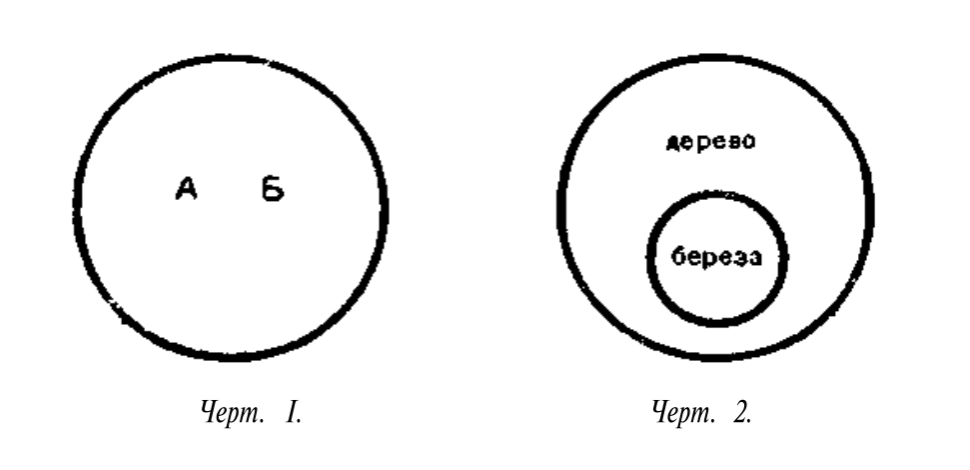
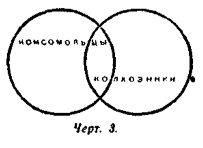
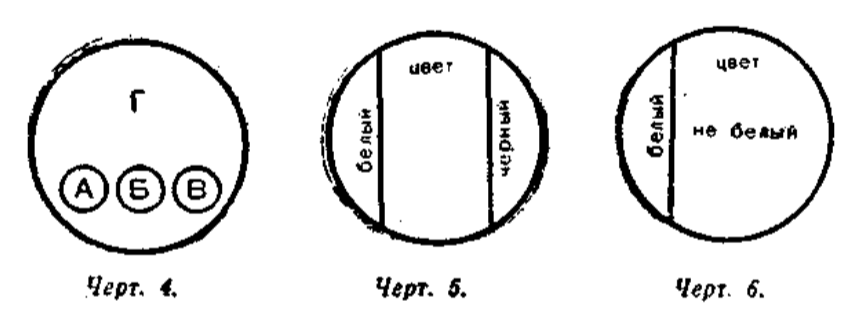
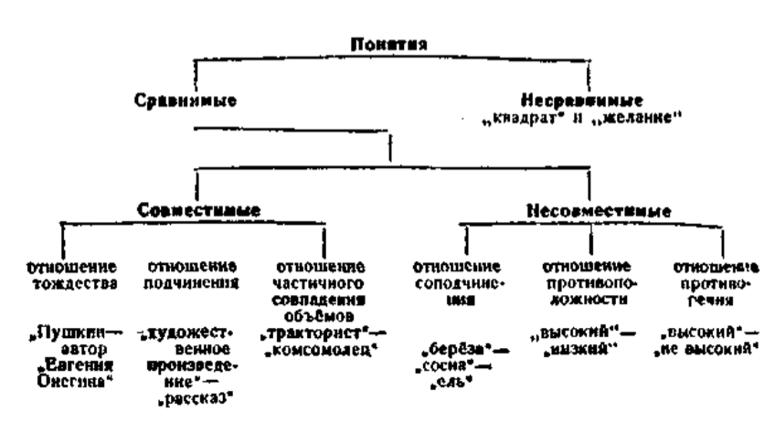

# Глава III. ПОНЯТИЕ

> Редакционное примечание. Текст главы адаптирован для современного читателя: исправлены артефакты распознавания, унифицирована разметка, сокращены идеологически перегруженные фрагменты, не влияющие на понимание логического содержания.

### § 1. Сущность понятия

Из предыдущей главы мы знаем, что мышление есть отображение в сознании человека общих существенных свойств вещей и явлений внешнего мира.

Те вещи и явления окружающей нас действительности, о которых мы мыслим, принято в логике называть **предметами мысли**. Так, например, предметами нашей мысли могут быть карандаш, урожай, революция, ученик, высота, движение и т. п.

Вещи и явления обладают различными свойствами. Свойства вещей и явлений называются в логике **признаками**. Например, длина карандаша, его цвет, свойство быть орудием письма — всё это его признаки. Своими признаками вещи и явления либо отличаются друг от друга, либо сходны друг с другом.

Познавая окружающую действительность, человек сравнивает предметы друг с другом, выявляет их сходство и различие; путём анализа и синтеза вскрывает сущность предметов, мысленно выделяет их признаки, абстрагирует и обобщает эти признаки.

В результате человек образует **понятие** о предметах и явлениях действительности.

**Понятие** — это мысль, которая отображает общие и существенные признаки предметов.

Например, в понятии «комета» отображены следующие признаки комет: 1) светило; 2) состоит из крайне разреженных газов; 3) при приближении к Солнцу постепенно выбрасывает светящийся хвост.

Все три перечисленных признака являются общими и существенными для комет.

Другой пример. В понятии «белки» отображены такие общие и существенные признаки белков: 1) это органические вещества; 2) их молекулы состоят из соединённых в большом количестве остатков различных аминокислот.

Существенным признаком предмета называется тот признак, который выражает коренное, наиболее важное свойство предмета; если существенный признак отсутствует, то предмет перестаёт быть данным предметом.

Например, существенным признаком химического элемента является строение атома, а несущественными — то или иное физическое состояние, внешняя форма и др.

Понятия являются правильными только в том случае, если они верно отражают действительность. Если же какое-либо понятие представляет собой неверное, искажённое отображение действительности, то такое понятие является ложным. Ложные понятия возникают, например, при отрыве теории от практики.

Правильные понятия вырабатываются в процессе деятельности многих людей; соответствие таких понятий предметам и явлениям действительности проверяется практикой.

### § 2. Понятие и представление

Понятия существенно отличаются от представлений.

**Представления** — это наглядные образы предметов и явлений. Поэтому нельзя, например, иметь представление о скорости движения света, так как нельзя получить наглядный образ такого движения. Но мыслить скорость движения света мы можем. Мы имеем понятие о движении света со скоростью 300 000 километров в секунду.

Представления всегда имеют индивидуальный характер. В них главное не отделяется от второстепенного, и они могут складываться из несущественных признаков.

**Понятия**, в отличие от представлений, отражают сущность вещей. Они имеют характер всеобщности: одними и теми же понятиями пользуется множество разных людей.

Понятия, являясь отражением объективного мира, возникают в результате мыслительной деятельности многих людей. Они отличаются устойчивостью и, как всякий накопленный людьми опыт, передаются с помощью языка от человека к человеку.

Мы постоянно пользуемся понятиями как основным фондом наших знаний, в котором запечатлена многовековая практика человека.

### § 3. Понятие и слово

Понятие, как и всякая мысль, возникает и существует на базе языкового материала, на базе языковых терминов и фраз.

Языковой оболочкой понятия является слово. Так, например, понятие о школе вообще выражается словом «школа». Когда мы мыслим не о школе вообще, а о той школе, в которой учимся, то такая мысль выражается группой слов: «наша школа» или «средняя школа, в которой мы учимся».

В этом примере предметом мысли является школа. Кроме слова «школа», обозначающего предмет мысли, имеются и другие слова: «средняя», «в которой мы учимся». Эти слова обозначают признаки предмета. Но в нашем примере нет такого слова, которое являлось бы сказуемым к слову «школа». Следовательно, данная группа слов не является предложением, она лишь служит для выражения понятия.

Другие примеры: «быстро плывущая лодка», «дом, который строится», «блестящая победа».

Часто одно и то же понятие можно выразить разными словами. Например: «тот, кто победил» и «победивший». Группа из трёх слов «тот, кто победил» выражает то же понятие, которое обозначено словом «победивший».

Другой пример: «ученик, который читает книгу» и «ученик, читающий книгу».

Нередки случаи, когда слова, сходные по звучанию, употребляются для выражения разных понятий. Например: коса — сельскохозяйственное орудие для косьбы травы; коса — пряди волос, сплетённые вместе; коса — длинная узкая отмель, идущая от берега; коса — узкая полоса леса.

Другие примеры таких слов, то есть омонимов: мир, ключ и др.

Неправильное употребление омонимов неизбежно приводит к смешению понятий, то есть к ошибкам в рассуждении.

### § 4. Содержание и объём понятий

Каждое понятие имеет содержание и объём.

**Содержание понятия** — это знание о совокупности существенных признаков класса предметов.

Например, в содержание понятия «стратостат» входят следующие существенные признаки: воздушный шар с гондолой, оборудованный для полётов в стратосферу.

Таким образом, содержание понятия — это знание о предметах, к которым относится данное понятие, знание об их сущности и свойствах.

Если содержание понятия верно отражает действительность, то такое понятие будет правильным; в противном случае оно будет неправильным, ложным.

В ходе человеческой практики, по мере того как люди глубже познают материальный мир, содержание понятий обогащается новыми признаками, а устаревшие признаки отбрасываются. Например, содержание понятия об электричестве менялось и обогащалось новыми признаками по мере того, как познавались новые, ранее неизвестные свойства электричества. Современное научное понятие об электричестве глубже и вернее отражает сущность этих явлений, чем понятие, существовавшее, скажем, в конце XIX века.

Но понятия изменяются не только потому, что люди глубже проникают в сущность явлений, но также и потому, что сами явления со временем меняются. Однако в течение какого-то периода содержание наших понятий бывает устойчивым и сохраняет свою определённость.

В понятиях содержится знание не только о признаках предметов, но и о том, на какие предметы данное понятие распространяется. Иначе говоря, каждое понятие имеет не только содержание, но и свой объём.

**Объём понятия** — это знание о круге предметов, существенные признаки которых отображены в понятии.

Например, объём понятия «страны света» составляют все мыслимые в этом понятии части горизонта: север, юг, восток, запад. Объём понятия «стратостат» составляют все мыслимые виды стратостатов.

Такой круг предметов может быть различным. Например, понятие «растение» распространяется на неограниченный круг растений: на все те растения, которые когда-либо были, есть и будут.

Понятие «полюс Земли» распространяется только на две точки земного шара. Могут быть и понятия, которые относятся только к одному предмету, например понятие о современной Франции, о реке Енисей или о центре Земли.

### § 5. Соотношение между содержанием и объёмом понятия

Между содержанием и объёмом понятия существует определённое соотношение. Рассмотрим это на примере.

В объём понятия «позвоночные» входят все виды позвоночных животных, а его содержанием являются существенные признаки, общие для всех позвоночных. Возьмём понятие, меньшее по объёму: «млекопитающие». В объём этого понятия входят не все виды позвоночных, а только часть их; следовательно, объём понятия будет меньше.

Однако содержание понятия расширяется за счёт новых признаков. Понятие «млекопитающие» содержит в себе признаки позвоночных, поскольку всякое млекопитающее есть позвоночное, а кроме того, оно содержит ещё свои особые признаки, например кормление детёнышей молоком, которых не было в содержании понятия «позвоночные».

Другой пример: всякая берёза есть дерево, следовательно, понятие «берёза» содержит в себе все признаки понятия «дерево». Но берёза имеет ещё и свои особые признаки, следовательно, в содержании понятия «берёза» признаков больше, чем в содержании понятия «дерево». Однако по объёму понятие «берёза» уже, чем понятие «дерево».

Итак, понятия, более широкие по объёму, являются более узкими по содержанию. Такова зависимость между содержанием и объёмом понятий. Эта зависимость имеет значение закона, который называется **законом обратного отношения содержания и объёма понятий**.

Формулировка закона следующая:

**чем шире содержание понятия, тем уже его объём.**

И соответственно наоборот:

**чем уже содержание понятия, тем шире его объём.**

Закон обратного отношения распространяется только на такие понятия, из которых одно входит в объём другого.

Однако из данного закона не следует, что более широкие по объёму, то есть более общие, понятия имеют для нас меньшую ценность. Общие понятия отображают общие свойства, связи и закономерности предметов и явлений объективного мира.

### § 6. Ограничение и обобщение понятия

В практике мышления мы нередко пользуемся логическими приёмами, которые называются обобщением понятия и ограничением понятия.

**Обобщить понятие** — это значит перейти от менее общего к более общему понятию.

**Ограничить понятие** — это значит перейти от более общего понятия к менее общему понятию.

В соответствии с этим, согласно закону обратного отношения, изменяется содержание понятия.

Рассмотрим процесс ограничения понятия на следующем примере. Объяснение того, что такое натрий, можно начать с напоминания о том, что представляет собой вообще элемент, а затем в понятие «элемент» ввести некоторые признаки, свойственные металлу. Введение этих признаков сузит объём понятия «элемент» и тем самым даст другое понятие с меньшим объёмом — понятие «металл».

Далее, вводя в понятие «металл» признаки, свойственные натрию, мы тем самым ещё больше ограничиваем это понятие, то есть даём вместо него ещё менее общее понятие — «натрий».

Таким образом, процесс ограничения понятия представляет собой постепенный переход от более общих понятий к менее общим.

Ограничением понятий мы пользуемся в тех случаях, когда разъясняем содержание какого-либо понятия, причём строим своё разъяснение на основе уже известных, более общих понятий.

Ограничение понятия применяется и тогда, когда необходимо уточнить содержание понятия, указать, к какому именно кругу явлений оно относится, следовательно, отграничить его от других понятий, в том числе и от более общих.

В процессе ограничения понятий, переходя от более общих понятий к менее общим, мы приходим наконец к таким понятиям, объём которых равен единице и которые, следовательно, не могут подлежать дальнейшему ограничению. Такие понятия отражают единичные, индивидуальные предметы и являются предельно узкими по объёму.

Примеры таких понятий: «Каспийское море», «Первая мировая война», «улица Горького в Москве».

Обобщение понятия представляет собой процесс, обратный ограничению. При обобщении понятия путём исключения некоторых его признаков мы переходим от менее общих ко всё более и более общим понятиям. Например, от понятия «чех» — к понятию «славянин», от понятия «славянин» — к понятию «человек».

Процесс обобщения понятия протекает на основе того, что круг рассматриваемых нами предметов всё более расширяется за счёт новых, отличных по своим свойствам предметов.

Обобщением понятий широко пользуется наука, которая всегда стремится вскрыть в предметах наиболее общие их свойства.

Обобщая понятия, переходя от менее общих к более общим, мы приходим наконец к предельно широким по объёму понятиям, которые не подлежат дальнейшему обобщению.

Такие понятия называются **категориями**.

Примеры категорий: «материя», «время», «движение», «пространство», «количество», «форма» и др.

### § 7. Родовые и видовые понятия

Мы уже знаем, что как в процессе ограничения, так и в процессе обобщения получается ряд понятий, из которых одни являются менее общими, а другие — более общими.

Более общие понятия называются **родовыми понятиями**, менее общие — **видовыми понятиями**.

Возьмём ряд понятий: «город» — «столица» — «Москва». Понятие «город» будет родовым по отношению к понятию «столица», а понятие «столица» будет родовым по отношению к понятию «Москва». Но те же самые понятия находятся и в другом отношении: понятие «Москва» является видовым по отношению к понятию «столица», а понятие «столица» является видовым по отношению к понятию «город».

Таким образом, одно и то же понятие может быть и видовым, и родовым, но только в разных отношениях: по отношению к менее общему оно родовое, а по отношению к более общему — видовое. В приведённом выше примере понятие «столица» является видовым по отношению к понятию «город» и родовым по отношению к понятию «Москва».

Родовое понятие, или род, не может существовать отдельно от видовых понятий, а видовые понятия, или виды, не могут существовать отдельно от рода. Род и вид всегда взаимно связаны.

Эта взаимная связь рода и вида отражает существующую в предметах связь общего и отдельного. Каждый предмет объективного мира содержит в себе и общие свойства, которые объединяют его с однородными предметами, и свои особые свойства.

Например, яблоко есть плод, то есть обладает общим свойством, присущим яблокам и другим плодам; но яблоко имеет также свои особые свойства, которых нет у других плодов. Сосна есть дерево, то есть обладает общим свойством, но при этом имеет и свои особые свойства, отличающие её от других деревьев.

Общие свойства существуют только в отдельных предметах. Тем самым общие свойства являются признаками отдельных предметов.

Так как всякое яблоко есть плод, то «плод» есть признак яблока; «дерево» есть признак сосны и т. д. Причём эти общие свойства являются существенными признаками, так как выражают коренные свойства предметов.

Точно так же родовые понятия, отражая объективную связь предметов и явлений действительности, являются признаками своих видов.

Когда мы говорим «химия есть наука», то указываем, к какому роду относится химия, и в то же время указываем её существенный, родовой признак.

### § 8. Основные классы понятий

По своему объёму понятия делятся на единичные и общие.

**Единичные понятия** являются понятиями об отдельных, единичных предметах.

Примерами таких понятий могут быть следующие: «полководец М. И. Кутузов», «город Санкт-Петербург», «самое глубокое озеро в мире».

В **общих понятиях** отображается множество однородных предметов.

Например: «звезда», «книга», «школа», «песня», «урожай» и др.

Каждое из этих понятий относится к большой группе однородных предметов.

Общие понятия могут быть более общими и менее общими. Так, понятие «трактор» является менее общим по отношению к понятию «сельскохозяйственная машина», но более общим по отношению к понятию «гусеничный трактор».

Число предметов, которые охватываются общим понятием, может быть ограниченным или неограниченным. Например, общее понятие «корабль» относится ко всем кораблям, которые были, есть и будут.

К общим понятиям с ограниченным объёмом относятся такие понятия, как «станции Московского метро первой очереди», «произведения Лермонтова», «учёные XIX века».

Общие и единичные понятия могут быть также собирательными.

**Собирательные понятия** — это такие понятия, в которых мыслится совокупность однородных предметов как единое целое.

Например: «лес», «библиотека», «собрание».

Особенность собирательных понятий заключается в том, что их нельзя приложить к отдельным предметам, совокупность которых мыслится в данном собирательном понятии. Нельзя, например, отнести понятие «лес» к отдельному дереву, а понятие «собрание» — к отдельному участнику собрания.

Собирательные понятия можно приложить или к совокупности предметов как единому целому, или к ряду таких совокупностей. В первом случае будет единичное собирательное понятие, во втором — общее собирательное понятие.

Например, понятие о конкретной библиотеке будет единичным собирательным понятием, а понятие о библиотеке вообще — общим собирательным понятием, так как оно относится ко многим библиотекам.

Примеры общих собирательных понятий: «группа», «созвездие», «коллектив», «полк», «народ», «толпа», «класс» и др. Примеры единичных собирательных понятий: «созвездие Большая Медведица», «коллектив служащих данного учреждения».

Каждое понятие находится в различных отношениях с другими понятиями и поэтому одновременно может входить в разные классы.

Например, понятие «высота» — общее, несобирательное; понятие «собрание» — общее, собирательное; понятие «единство стиля и содержания в рассказах А. П. Чехова» — единичное, собирательное.

### § 9. Отношения между понятиями

Все вещи и явления объективного мира находятся во всеобщей связи и взаимозависимости. И наши понятия, являясь отражением объективного мира, также находятся во взаимной связи друг с другом, в том или ином отношении друг к другу.

Между некоторыми понятиями связь является очень слабой, мало заметной. Какая, например, имеется связь между понятиями «медведь» и «классная доска»? Только та, что оба они представляют собой отражение определённых явлений действительности, а с точки зрения логики оба являются общими, несобирательными понятиями.

Такие понятия, которые по своему содержанию находятся в далёком отношении друг к другу, называются **несравнимыми понятиями**.

Все остальные понятия являются **сравнимыми**. Они делятся на две группы: 1) совместимые понятия и 2) несовместимые понятия.

Если объёмы двух или более понятий совпадают полностью или частично, то это будут **совместимые понятия**; если же не совпадают, то это будут несовместимые понятия.

Заметим, что в том и другом случае имеются в виду именно объёмы понятий. Следовательно, отношения между понятиями, которые рассматриваются далее, — это отношения по объёму.

В целях наглядности эти отношения изображаются графически в виде кругов: каждый круг обозначает объём понятия.

Рассмотрим группу совместимых понятий.

**Отношение тождества.** Есть понятия, которые могут различаться по своему содержанию, но в которых мыслится один и тот же предмет. Такие понятия находятся в отношении тождества.

Например: «Первая мировая война» и «мировая война 1914 года». В этих двух понятиях мыслится одна и та же война, но при этом выделяются в качестве признаков разные её стороны.

Отношение тождества изображено в виде двух кругов, совпадающих при наложении: объём одного понятия полностью совпадает с объёмом другого.

Другой пример: «Москва» и «столица России».

**Отношение подчинения.** При отношении подчинения одно понятие, менее общее, входит в объём другого, более общего. Отношение подчинения есть отношение вида и рода.

Объём видового понятия совпадает с частью объёма родового понятия. Например: «берёза» и «дерево». Понятие, большее по объёму, — «дерево» — полностью включает в себя понятие, меньшее по объёму, — «берёза».

Более общее, родовое понятие называется **подчиняющим**, а менее общее, видовое, — **подчинённым понятием**.

Отношение подчинения понятий не следует смешивать с отношением части и целого.

Такие, например, понятия, как «месяц» и «год», «ветви» и «дерево», «цех» и «завод», относятся как часть к целому, но не как вид к роду. Нельзя, например, сказать, что «каждый месяц есть год», но можно сказать, что «каждый куст есть растение».

Конечно, кусты тоже являются частью всех растений, но они не только часть растений, но и вид растений, в то время как месяц — только часть, но не вид года, а цех — только часть, но не вид завода.

**Отношение частичного совпадения объёмов.** В таком отношении находятся, например, понятия «студенты» и «спортсмены». Часть студентов — спортсмены, а часть спортсменов — студенты.

На чертеже 3 показано, как часть объёма одного понятия совпадает с частью объёма другого понятия.

Такие понятия, объёмы которых частично совпадают, называются **перекрещивающимися понятиями**.

Другие примеры перекрещивающихся понятий: «москвичи» и «художники»; «поэты» и «учителя».

Отношения тождества, подчинения и частичного совпадения объёмов являются отношениями совместимых понятий, то есть таких понятий, объёмы которых в той или иной мере совпадают.

Между несовместимыми понятиями также существуют три вида отношений: отношение соподчинения, отношение противоположности и отношение противоречия.

**Отношение соподчинения.** Когда одному и тому же родовому понятию подчинены несколько видовых понятий, то эти видовые понятия находятся между собой в отношении соподчинения.

Например: понятия «Европа», «Азия», «Африка» находятся в отношении соподчинения, так как каждое из них является видом по отношению к понятию «части света».

Отношение соподчинения есть отношение между видами, объединёнными общим родом.

На чертеже 4 показано отношение соподчинения, в котором находятся понятия А, Б и В, общим родом для которых является понятие Г. Объёмы соподчинённых понятий не совпадают друг с другом, но все они входят в объём одного и того же родового понятия.

В качестве другого примера соподчинённых понятий можно привести разные виды общественного строя, объединённые общим родовым понятием «общественный строй».

**Отношение противоположности.** В отношении противоположности находятся такие два понятия, которые по своему содержанию противоположны друг другу, но оба входят в объём одного и того же родового понятия.

Например: «чёрный цвет» и «белый цвет», общий род для них — «цвет». Другие примеры: «храбрость» и «трусость», «подъём» и «спуск».

Каждое из противоположных понятий не только отрицает своим содержанием другое, противоположное понятие, но и утверждает взамен него нечто новое, несовместимое с ним.

**Отношение противоречия.** В отношении противоречия находятся такие два понятия, из которых одно полностью отрицает другое, но содержание отрицающего понятия остаётся неопределённым.

Например: «чёрный» и «не чёрный»; «высокий» и «не высокий».

На чертеже 6 показано отношение противоречия. Объём понятия разделён на две части, из которых одна совершенно несовместима по своему содержанию с другой. Однако содержание отрицающей части остаётся нераскрытым.

Отношения между понятиями:

## ВОПРОСЫ ДЛЯ ПОВТОРЕНИЯ

1. Что называется понятием?
2. Что такое существенные признаки? Приведите примеры.
3. Чем отличается понятие от представления?
4. Что такое содержание понятия?
5. Что такое объём понятия?
6. Что такое ограничение понятия?
7. Что такое обобщение понятия?
8. Какое существует отношение между объёмом и содержанием понятия?
9. Укажите основные классы понятий. Приведите примеры.
10. Какие могут быть отношения между понятиями?
11. Чем отличаются противоположные понятия от противоречащих понятий?
